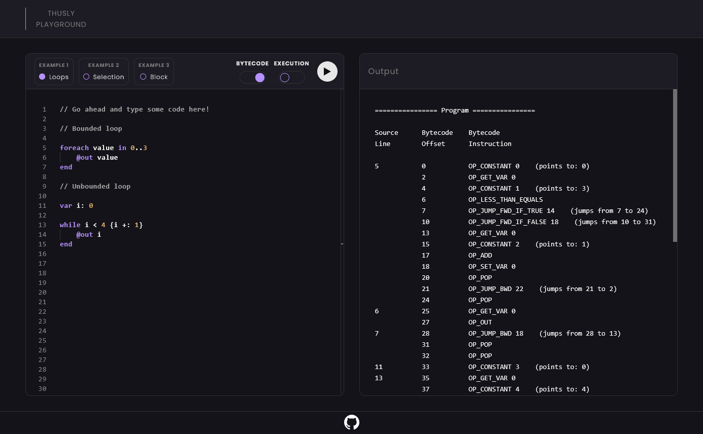

# Interactive Browser Playground for Thusly

An interactive playground in the browser for the Thusly programming language.

## Try Out the Playground

TODO: Will add link to live URL.

### Screenshot



### Functionality

* Write Thusly code in VS Code's Monaco Editor.
* Execute Thusly code.
  * Enable `Bytecode` to see the compilation bytecode output.
  * Enable `Execution` to see the VM execution trace.
* Choose between pre-made Thusly code examples or write everything yourself.

## Getting Started

The instructions below show how to build and run the playground locally on your machine. To start the live playground without building it, see [Try Out the Playground](#try-out-the-playground).

### Prerequisites

* [Emscripten](https://emscripten.org/docs/getting_started/downloads.html#download-and-install)
  * Download the recommended emsdk.
  * Don't forget to activate PATH and other environment variables in your terminal after installing it.
    ```sh
    source path/to/emsdk_env.sh
    ```
* [Node.js](https://nodejs.org/en/download)

### Building the Project

Run the below command to compile the C source code to WebAssembly and generate browser distribution files to `dist`.

```sh
./build_playground.sh
```

> **If permission is denied**, first add executable permission to the build script by running:
> `chmod +x build_playground.sh`.

### Starting the Playground

Once you have [built](#building-the-project) the project you can open `dist/index.html` in a browser via an HTTP server.

> **HTTP Server:**
>
> You cannot open the HTML file directly from your local hard drive (`file://`). You need to run it through an HTTP server (`http://`). If you are using VS Code, you can use the extension [Live Server](https://marketplace.visualstudio.com/items?itemName=ritwickdey.LiveServer).
